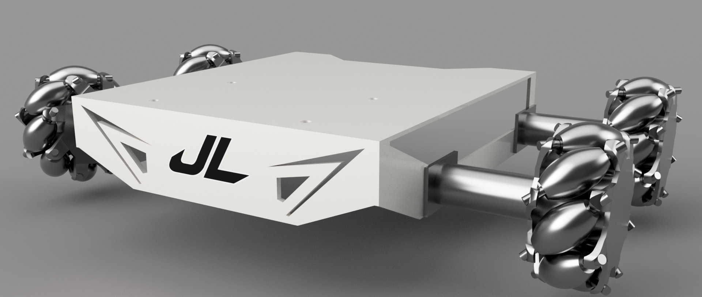
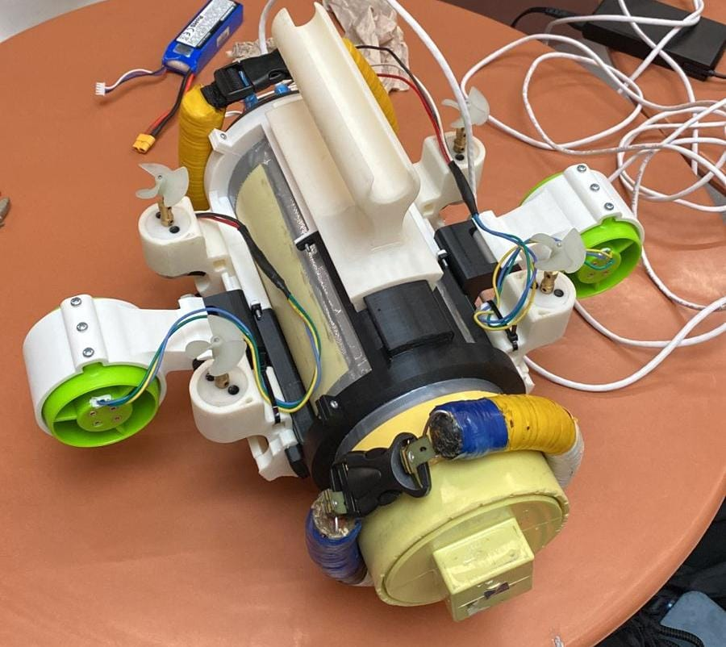

# Remotely Operated Underwater Vehicle  (ROV)

<p align="center">

</p>

<p align="center">


</p>

## Overview

This project presents the development of an **Autonomous Underwater Vehicle (AUV)** designed for underwater exploration, environmental monitoring, and marine data acquisition.

The platform combines a robust mechanical structure, efficient propulsion system, onboard sensing, and a modular **ROS2-based software architecture** to enable autonomous navigation and real-time communication between system components.

The project has been developed with scalability in mind, allowing the integration of additional sensors, navigation algorithms, computer vision modules, and autonomous mission planning.

---

# Features

- ROS2 distributed architecture
- Modular software design
- Multi-thruster propulsion system
- Real-time sensor fusion
- Pressure and depth monitoring
- IMU-based attitude estimation
- Sonar and underwater sensor integration
- Mission planning framework
- Expandable payload system

---

# System Architecture

<p align="center">

</p>

The software is built on **ROS2**, enabling communication between independent nodes responsible for:

- Navigation
- Localization
- Thruster control
- Sensor drivers
- Mission management
- State estimation
- Diagnostics
- Telemetry

ROS2 provides:

- Publisher/Subscriber communication
- Services
- Actions
- Parameter server
- Lifecycle nodes

---

# Mechanical Design

<p align="center">

</p>

The vehicle features a pressure-resistant modular frame optimized for underwater operation.

Main characteristics include:

- Lightweight structural frame
- Waterproof electronics compartment
- Modular payload section
- Six-degree-of-freedom propulsion layout
- Corrosion-resistant materials
- Easy maintenance and assembly

The mechanical design was created entirely in CAD, allowing rapid prototyping and future upgrades.

---

# CAD Models

The complete mechanical design is available in:


Including:

- STEP assembly
- Individual components
- Manufacturing drawings
- Exploded assembly

---

# Electronics

<p align="center">

</p>

The onboard electronics include:

- Flight computer
- Embedded controller
- IMU
- Pressure sensor
- Leak detection system
- Power management
- ESCs
- Thruster drivers
- Battery monitoring

---

# Software Stack

- ROS2 Humble
- C++
- Python
- Gazebo Simulation
- RViz2
- URDF
- TF2
- Navigation
- Sensor Fusion

---

# Simulation

<p align="center">

</p>

Before deployment, the robot can be tested in simulation using Gazebo and RViz2.

Simulation enables:

- Navigation testing
- Sensor validation
- Control tuning
- Mission development
- System integration

---

# Repository Structure

```
.
├── config/
├── docs/
│   ├── images/
│   └── CAD/
├── launch/
├── meshes/
├── src/
├── urdf/
├── worlds/
└── README.md
```

---

# Installation

Clone the repository

```bash
git clone https://github.com/yourusername/auv.git
```

Move into the workspace

```bash
cd auv_ws
```

Build

```bash
colcon build
```

Source

```bash
source install/setup.bash
```

Launch

```bash
ros2 launch auv bringup.launch.py
```

---

# Future Improvements

- Underwater SLAM
- Computer vision
- Sonar mapping
- Autonomous docking
- Path planning
- Multi-robot communication
- Acoustic localization

---

# Gallery

| Prototype | Mechanical Design |
|------------|------------------|
|  |  |

| Electronics | Simulation |
|------------|-------------|
|  |  |

---

# Project Status

🚧 Active Development

---

# License

MIT License
